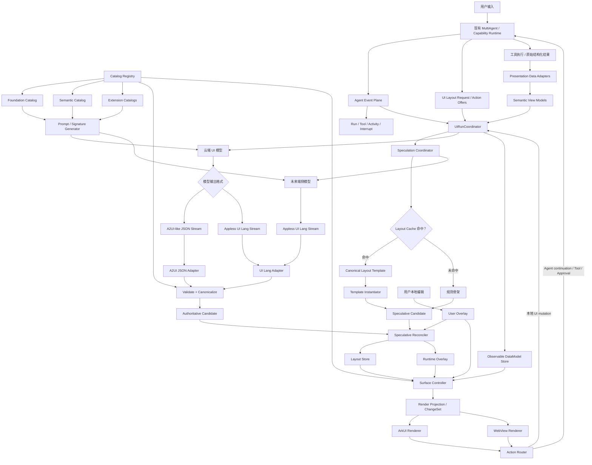
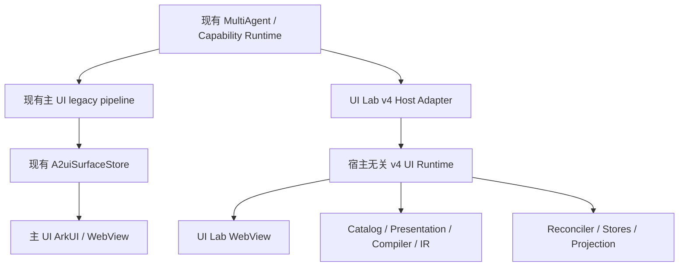

# Appless 生成式 UI v4：分层 UI Runtime 与模型语言方案

状态：v4 proposal / 2026-08-13
上游文档：`docs/ui-gen-refactor-plan.md`（v3）
执行清单：`docs/ui-gen-landing-checklist-v4.md`
当前实施记录：`docs/ui-gen-landing-checklist.md`

---

## 0. 结论

v4 不推翻现有统一 UI IR、快速骨架、流式组件扫描和客户端 reconcile；它重新划清这些能力的边界：

1. **模型输出不是内部事实**。JSON/A2UI 与未来的 Appless UI Lang 都只是模型输入适配格式。
2. **Canonical UI IR 是唯一稳定语义表示**。缓存、diff、回放和渲染均以它为基准。
3. **Patch 由客户端产生**。模型产生 Candidate UI；客户端验证、规范化后计算 layout/runtime/data mutations。
4. **投机态和用户编辑态不进入 Canonical Node**。`shimmer/confirmed/hydrated` 属于 Runtime Overlay；`pinned/hidden/order` 属于 User Overlay。
5. **Agent 事件与 UI IR 分离**。Run、Tool Call、Activity、Interrupt、Error 使用独立 Event Plane。
6. **OpenUI 借鉴前移**。立即设计并验证 OpenUI-like 的 Appless UI Lang，但不直接引入 React Runtime，也不允许模型直连 Query/Mutation。
7. **A2UI 是适配协议，不是内部对象模型的永久边界**。现有 v0.9.1 输入继续兼容；自定义 `patchComponents` 明确为 Appless 内部兼容消息。
8. **Catalog 以跨场景语义组件为主**。工具原始结果先转换成标准 Presentation View Model；只有具有独特交互状态机、平台能力或展示语义的能力才能进入领域 Extension Catalog。
9. **v4 是独立、宿主无关的 UI Runtime**。核心代码位于 `agent_core`，不得依赖 UI Lab、主页面或某个具体 Agent Runtime。
10. **UI Lab 是 v4 的第一个且初期唯一消费者**。主 UI 在 UI Lab 完成 shadow、可见切换和实验门槛前继续使用现有 legacy 链路。
11. **UiRunCoordinator 位于现有 MultiAgent Runtime 下游**。它只协调一次 UI run 的数据、Candidate、投机、revision 和 Surface，不重新实现任务规划、Agent 协作、Tool 执行或真实 Action 执行。

一句话架构：

> 现有 MultiAgent Runtime 产生 Agent Event、Tool Result、Action Offer 和 UI Layout Request；宿主无关的 v4 UiRunCoordinator 在其下游协调 Presentation、Compiler、Speculation、Reconcile 和 Surface Runtime。v4 首先仅由 UI Lab 消费，主 UI 暂时保持旧链路。

---

## 1. 当前实现基线

### 1.1 已完成或已经贯通

以下能力作为 v4 的现有资产保留：

- `OpenAiA2uiModel.generate()` 已使用 SSE、增量 UTF-8 解码和 `onTextDelta`。
- `A2uiUpdateComponentsStreamScanner` 已能从流中提取完整组件对象。
- `StructuredToolUiRenderer` 已将闭合子树投影、校验、合并后转换为内部 patch。
- `A2uiSurfaceStore` 已支持 `insert/replace/remove/confirm`、统计和用户编辑保护。
- `SkeletonPlanner` 已支持 context/keyword/fallback 快速路由和确定性节点 ID。
- `Index.seedFastSubmissionSkeleton()` 已在主链同步写入首帧骨架。
- `runtimeGeneration`、surface lease 与入口 gate 已能丢弃旧 turn 回调。
- HTML 已支持 `data-node-id`、`data-render-state` 和纯状态局部更新。
- ArkUI 已具备 shimmer 占位路径。

### 1.2 尚未完成

- 真实流式页面、confirm 命中率、断流和 BIM/multi-task 真机验收尚未全部闭环。
- HTML 结构 insert/move 仍可能回退整页刷新。
- `LayoutCache`、`GrammarStore` 尚未进入生产 ArkTS 实现。
- `renderState/pinned/hidden/orderHint` 仍与组件语义混合。
- `sequence` 仍承担布局、数据和运行时状态的混合版本职责。
- Action 仍包含 prompt 字符串，缺少统一 UiEvent/ActionRouter 边界。
- Agent 运行事件缺少面向前端的统一生命周期表示。
- JSON/A2UI parser 与内部 IR 仍高度耦合，尚无通用 UI Compiler 接口。

### 1.3 v4 对 v3 的关键修正

| v3 假设或设计 | v4 决策 |
| --- | --- |
| 模型可直接输出 patch/confirm | 模型输出 Candidate；客户端生成 mutation/confirm |
| `patchComponents` 是协议扩展中心 | 降为内部兼容格式，核心改为 Canonical IR + mutations |
| `renderState` 属于 Component | 移入 Runtime Overlay |
| 用户 pin/hide/order 属于 Component | 移入 User Overlay |
| 单 `sequence` 管全部更新 | 拆为 epoch/layout/data/runtime/overlay revisions |
| LayoutCache 直接缓存组件数组 | 只缓存规范化 authoritative layout template |
| OpenUI-like DSL 放在后期 | 立即做语言与编译器 PoC，生产切换后置 |
| Agent 进度主要靠 surface.status | Run/Tool/Activity/Interrupt 走独立 Event Plane |
| `TrainOptions/FoodChoices/...` 按场景扩展组件 | Foundation + Semantic + Extension 三层 Catalog；场景差异优先进入 Presentation Adapter |
| Tool 原始 schema 直接绑定场景组件 | Tool Result → Presentation Adapter → 标准 View Model → Semantic Component |

---

## 2. 目标与非目标

### 2.1 目标

- 支持规则、缓存、端侧模型、云端模型产生同一种 Canonical UI 结果。
- 首个有效 UI 节点可随模型输出增量产生。
- 云端 authoritative 结果能安全确认、修正或替换投机结果。
- 业务数据更新只影响依赖该路径的节点。
- 用户本地编辑在云端布局更新后仍可保持。
- 旧 turn、重复消息、乱序数据和断线重放可确定处理。
- ArkUI 与 WebView 对相同 Canonical Surface 得到等价界面语义。
- 模型只能使用 Catalog 和系统签发的 Action Offer，不能生成任意代码或越权工具调用。
- 模型主要组合跨场景 Semantic Components，而不是按工具或业务场景选择预制页面组件。
- 餐厅、酒店、商品等异构工具结果能映射为共享的 Presentation View Model。
- A2UI JSON 与 Appless UI Lang 可以并存并逐步切换。
- v4 Core 可以由 UI Lab、主页面或未来其他宿主通过相同 Host Ports 接入。
- UI Lab 可以独立切换 legacy/v4/shadow，而不改变主 UI 的生产行为。

### 2.2 非目标

- 不切换到 Flutter。
- 不把 AG-UI 当作 UI IR。
- 不直接采用 OpenUI React Runtime。
- 不允许模型在 UI Lang 中声明任意网络请求、脚本或未授权 Mutation。
- 不在 v4 第一阶段引入真正端侧模型。
- 不以一次大爆炸式重构替换现有 `A2uiSurfaceState` 和两个 Renderer。
- 不追求只用 `Row/Column/Text/Button` 拼装全部复杂界面；基础组件和高层语义组件同时保留。
- 不为每个 Tool、Provider 或 intent 创建专属 UI Component。
- 不在 v4 UI Runtime 中重新实现 Leader、DataAgent、Tool Executor 或 MultiAgent Runtime。
- 不让 `agent_core/.../ui/` 依赖 `entry/.../UiAgentLab` 或其他具体页面。
- 不在 UI Lab 验证完成前切换主 UI 的 Store、Renderer 或 Action 主链。

---

## 3. 总体架构



### 3.1 MultiAgent Runtime 与 UiRunCoordinator 的边界

`MultiAgent Runtime` 是任务执行系统；`UiRunCoordinator` 是它下游的 UI session 协调器。两者不得形成重复的 Agent Runtime。

| 职责 | MultiAgent / Capability Runtime | UiRunCoordinator |
| --- | --- | --- |
| 理解请求、任务拆分、Agent 协作 | 负责 | 不负责 |
| Tool 选择、参数构造和真实执行 | 负责 | 不负责 |
| 生成 Action Offer、执行真实 Action | 负责 | 只消费 offer，并把 UiEvent 路由回宿主 |
| 产生 Run/Tool/Activity/Interrupt 事件 | 负责 | 消费并投影为 UI 状态 |
| 创建 UI Surface session/epoch | 发起 UI request | 负责 |
| Presentation Adapter、DataModel mutation | 提供 Tool Result | 负责协调 |
| UI 模型、Compiler、Candidate | 提供请求上下文 | 负责协调 |
| LayoutCache 和 speculative candidate | 不负责 | 负责 |
| authoritative reconcile 和 revisions | 不负责 | 负责 |
| SurfaceController 和 Render Projection | 不负责 | 负责 |

建议接口只暴露 UI 生命周期，不暴露 Agent 执行能力：

```ts
export interface UiRunCoordinator {
  startSurface(request: UiSurfaceRequest): UiSurfaceSession;
  onAgentEvent(event: AgentUiEvent): void;
  onToolResult(result: UiHostToolResult): void;
  onModelDelta(delta: UiModelDelta): void;
  onModelCompleted(result: UiModelResult): void;
  onUiEvent(event: UiEvent): void;
  cancelSurface(reason: string): void;
}
```

具体 `MultiAgentCanaryRuntime` 只能由宿主 Adapter 引用，v4 Core 只认识 `UiRuntimeHostPorts` 等稳定接口。

### 3.2 首接拓扑：UI Lab 唯一消费 v4



初期约束：

- v4 的生产级核心全部放在 `agent_core`，不导入 UI Lab 页面代码；
- UI Lab 在 `entry` 层实现 Host Adapter，把现有 MultiAgent Runtime 的事件、Tool Result、Action Offer 和 UI request 转换为 v4 Host Ports；
- UI Lab 依次支持 `legacy`、`v4_shadow`、`v4_visible`，出现问题可回退自己的 legacy 路径；
- 主 UI 不双写 v4、不切新 Store、不切新 Renderer；只有 UI Lab 达到实验退出门槛后，才开始主流程 shadow；
- UI Lab 不是特殊 IR，也不得拥有 `UiLabCanonicalSurface/UiLabReconciler` 等分叉实现。

### 3.3 图中各类设计的位置

| 参考设计 | 图中位置 | v4 借鉴内容 | 明确不采用的部分 |
| --- | --- | --- | --- |
| OpenUI-like | `Prompt / Signature Generator`、`Appless UI Lang Stream`、`UI Lang Adapter` | 紧凑模型语言、行级流式解析、Catalog 生成 Prompt、增量程序更新 | React Runtime、任意 Query/Mutation、模型直接执行工具 |
| A2UI-like | `A2UI-like JSON Stream`、`A2UI JSON Adapter`，以及 Canonical IR 中的 Surface/Catalog/Binding/Action 概念 | 声明式组件图、安全 Catalog、Surface、DataModel binding、Action reference | 将某一版 A2UI wire schema 直接作为永久内部对象模型 |
| Flutter GenUI-like | `Surface Controller`、`Observable DataModel Store`、Catalog 驱动 Renderer、`Action Router` | 客户端 Surface Runtime、响应式 DataModel、组件 builder/renderer registry、UiEvent 回路 | Flutter Widget 和 Flutter SDK 本身 |
| AG-UI-like | `Agent Event Plane` | Run、Tool Call、Activity、State、Interrupt、Error 生命周期 | 用 Agent event 替代 UI IR |
| Appless 投机设计 | `Speculation Coordinator`、`Layout Cache`、`Speculative Candidate`、`Speculative Reconciler`、`Runtime Overlay` | 规则/缓存/端侧预测、云端 authoritative 校正、confirm/replace、用户编辑保护 | 把预测结果直接当最终事实 |

### 3.4 OpenUI-like 与 A2UI-like 的边界

OpenUI 和 A2UI 都能描述组件、属性、子节点、binding 和 action，因此如果在客户端同时保留两套完整 AST、状态容器和 Renderer，必然重复。v4 明确禁止这种双 Runtime 结构。

在 v4 中，两者只在 **UI Compiler 之前**并存：

```text
Appless UI Lang
面向模型生成：紧凑、低 token、行级 streaming
        │
        ├── UI Lang Adapter ──┐
        │                     │
        │                     ▼
        │              Canonical UI IR
        │                     ▲
        │                     │
A2UI-like JSON               │
面向现有实现和外部兼容       │
        └── A2UI JSON Adapter ┘
```

进入 `Validate + Canonicalize` 后，不再区分输入来自 OpenUI-like 语言还是 A2UI JSON。后续只有：

- 一套 Unified Component Catalog；
- 一套 Presentation View Model 契约；
- 一套 Canonical UI IR；
- 一套 Speculative Reconciler；
- 一套 Layout/Data/Runtime/User Store；
- 一套 Surface Controller；
- 一种 Render Projection/ChangeSet。

因此两者在 v4 中不是两个竞争 Runtime，而是两个 sibling codecs：

| 输入方式 | 主要使用者 | 长期定位 |
| --- | --- | --- |
| Appless UI Lang | 端侧/云端模型 | 默认的 model-facing generation language 候选 |
| A2UI-like JSON | 当前模型链路、外部 Agent/A2UI 兼容、调试和 fallback | compatibility wire format |
| Canonical UI IR | Reconciler、Cache、Surface Runtime、Renderer | 唯一内部事实 |

如果 UI Lang 灰度成功，Appless 自有模型链路可以默认输出 UI Lang；A2UI JSON Adapter 仍保留为外部互操作和兼容入口，但不会增加第二套内部状态。

### 3.5 缓存命中与投机路径

缓存命中不经过 Model Output Adapter，因为缓存条目已经是经过验证和清洗的 Canonical Layout Template：

```text
现有 MultiAgent Runtime
  → UI Layout Request
  → UiRunCoordinator
  → Speculation Coordinator
  → lookupByTaskShape / full-key validation
  → cache hit
  → Template Instantiator 分配当前 surfaceId/wire ids
  → Speculative Candidate
  → Reconciler commit layout + markPredicted
  → Surface Controller
  → 首屏
```

云端模型与这条快速路径并行：

```text
Cloud Model Stream
  → JSON Adapter 或 UI Lang Adapter
  → Validate + Canonicalize
  → Authoritative Candidate
  → Reconciler
      ├── 语义相同：markConfirmed，不重绘布局
      ├── 语义变化：局部 upsert/replace
      ├── 新节点：insert
      └── 预测多余节点：remove
```

缓存未命中时，`规则骨架` 产生低成本 Speculative Candidate；未来端侧模型则仍需通过 UI Lang Adapter 和 Compiler，因为端侧模型输出同样是不可信模型文本。

### 3.6 两条平行状态线

```text
Agent Event Plane
回答：Agent 正在做什么、工具执行到哪、是否需要用户确认。

UI Runtime
回答：当前 Surface 应展示什么、哪些节点是预测态、数据是否到达、用户改了什么。
```

两者只通过 `threadId/runId/turnId/surfaceId/actionId/toolCallId` 关联，不共享内部对象。

---

## 4. Model Output Adapter 与 UI Compiler

### 4.1 Adapter 接口

建议新增：

```text
agent_core/src/main/ets/aiphone/ui/compiler/
  UiModelOutputAdapter.ets
  A2uiJsonOutputAdapter.ets
  ApplessUiLangOutputAdapter.ets
  UiCandidateValidator.ets
  UiCanonicalizer.ets
```

概念接口：

```ts
export interface UiModelOutputAdapter {
  begin(context: UiCompileContext): void;
  feed(delta: string): UiAdapterOutput;
  finish(): UiAdapterOutput;
}

export interface UiAdapterOutput {
  candidates: UiCandidateFragment[];
  errors: UiCompileError[];
}
```

现有 `A2uiUpdateComponentsStreamScanner` 成为 `A2uiJsonOutputAdapter` 的底层实现，而不是最终 Runtime 协议。

### 4.2 Compiler 管线

```text
Text Delta
  → Adapter parse
  → Candidate fragment
  → Catalog schema validation
  → reference/tree closure check
  → binding/action validation
  → canonicalization
  → Canonical Surface Candidate
  → Reconciler
```

必须坚持：

- Parser 只解决语法。
- Validator 只解决 Catalog、字段、绑定和引用合法性。
- Canonicalizer 解决默认值、稳定身份、顺序和等价表示。
- Reconciler 才能读取当前 Surface 和 speculation metadata。
- Renderer 不接收未经验证的模型对象。

---

## 5. Appless UI Lang：OpenUI-like 模型语言

### 5.1 定位

Appless UI Lang 是模型友好的紧凑序列化格式，不是：

- Canonical UI IR；
- Tool 协议；
- Agent Event 协议；
- 可执行脚本；
- Renderer API。

首版目标：以比 JSON 更少的 token 和更稳定的行级闭合，生成等价 Canonical UI。

### 5.2 首版语法子集

```text
program      := statement*
statement    := identifier "=" expression newline
expression   := componentCall | array | literal | reference | binding | actionRef
componentCall:= TypeName "(" arguments? ")"
arguments    := expression ("," expression)*
array        := "[" (expression ("," expression)*)? "]"
reference    := identifier
binding      := "$" bindingPath
actionRef    := "ActionRef(" string ")"
literal      := string | number | boolean | null
```

首版不支持：

- 任意函数调用；
- Query/Mutation 声明；
- `eval`、脚本和网络请求；
- 算术或字符串表达式；
- 动态组件名；
- 模型自造工具 ID、Action 参数或 provider identity。

### 5.3 示例

```text
root = Surface([headline, form, actions])
headline = Text("预订餐厅", "headline")
form = Form([guests, time, windowSeat])
guests = NumberInput("人数", $booking.guests, 1, 20)
time = TimeInput("时间", $booking.time)
windowSeat = Switch("优先靠窗", $booking.windowSeat)
actions = ActionBar([submit])
submit = Button("查找餐厅", ActionRef("offer.restaurant.search"), "primary")
```

### 5.4 Streaming 规则

- 第一条有效语句必须定义 `root`，允许引用稍后出现的节点。
- Parser 对每一条闭合语句独立解析并保留 source span。
- 未解析的 forward reference 进入 pending set，不直接报整流失败。
- 当 root 的最小闭合子图成立时，生成第一个 Candidate Fragment。
- 后续节点到达后生成新的 Candidate Revision。
- 相同 identifier 的重新赋值表示 Candidate Program 更新，不直接等同于 Layout Patch。
- 流结束仍未闭合的引用产生结构化错误，并回退到最近一个已验证 Candidate。

### 5.5 Catalog 单一来源与三层结构

Catalog 定义同时驱动：

```text
组件名称和说明
模型 Prompt 中的紧凑签名
参数顺序
JSON/DSL schema
默认值与 canonicalization
ArkUI/Web renderer 注册
允许的 binding/action 类型
版本和 capability hash
```

建议组件定义：

```ts
export interface UiCatalogItem {
  name: string;
  version: string;
  layer: 'foundation' | 'semantic' | 'extension';
  groups: string[];
  description: string;
  propsSchemaJson: string;
  positionalFields: string[];
  childPolicy: 'none' | 'single' | 'many' | 'dynamic-list';
  rendererKey: string;
  allowedEvents: string[];
}
```

Catalog 不是按 intent 列举预制页面，而是按 UI 语义分为三层：

```text
Foundation Catalog
基础布局、内容和低阶交互原语
        ↓
Semantic Catalog
跨场景复用的业务表达组件，模型组合 UI 的主力
        ↓
Extension Catalogs
具有独特交互状态机、平台能力或展示语义的领域扩展
```

#### Foundation Catalog

建议首版包括：

```text
Surface
Stack
Row
Grid
Card
Text
Icon
Image
Badge
Divider
Progress
Spacer
Button
Tabs
```

Foundation 解决基础布局和简单内容，但不能要求模型仅靠它拼装所有复杂页面，否则会增加 token、结构错误和视觉不一致。

#### Semantic Catalog

建议首版包括：

```text
ResultCollection
ChoiceList
OptionCard
JourneyOptionList
ComparisonTable
KeyValueList
MetricGrid
Timeline
Schedule
MessageFeed
ThreadList
DetailPanel
Form
FormField
FilterBar
ActionBar
ApprovalPanel
AccountStatus
StatusNotice
ActivityFeed
MediaGallery
```

Semantic Component 描述界面语义，而不是数据来自哪个工具。例如餐厅、酒店、商品都可以使用 `ChoiceList<OptionItem>`；邮件和社交聚合可以共享 `MessageFeed<MessageItem>`；火车和航班可以共享 `JourneyOptionList<JourneyOption>` 或通用 `ChoiceList<OptionItem>`。

#### Extension Catalog

首版候选：

```text
calendar：CalendarMonthGrid
maps：RouteMap
travel：SeatSelector
mail：EmailThread
payment：PaymentSummary
media：MediaPlayer
```

Extension 不是“一个业务场景一个组件”。只有满足至少一项才允许新增：

1. 存在通用组件无法表达的独特交互状态机；
2. 依赖地图、媒体、日历等平台能力；
3. 有必须由专用 Renderer 保证的可访问性或复杂布局算法；
4. 有不可仅由通用 `ApprovalPanel + ActionRouter` 表达的领域展示语义。

仅字段名称、文案、图标、颜色、Provider 或 Tool schema 不同，不构成 Extension 理由。

### 5.6 组件粒度与准入规则

新增组件前必须回答：

| 问题 | 是 | 决策 |
| --- | --- | --- |
| 差异是否仅为数据字段、文案、图标或排列？ | 是 | 使用 Presentation Adapter + 现有 Semantic Component |
| 能否映射为现有标准 View Model？ | 是 | 不新增组件 |
| 是否存在独特交互状态机或平台能力？ | 是 | 可以评估 Extension |
| 安全差异是否可由 Action Offer/ActionRouter 表达？ | 是 | 使用通用 Approval/Action 组件 |
| 组件是否至少能跨两个场景复用？ | 否 | 默认拒绝，除非满足 Extension 硬条件 |

禁止的扩展模式：

```text
每新增一个 Tool → 新增一个组件
每新增一个 Provider → 新增一个组件
每新增一个 intent → 新增一个页面级组件
```

推荐模式：

```text
新 Tool Result
  → Presentation Adapter
  → 既有 Semantic View Model
  → 既有 Semantic Component
```

### 5.7 标准 Presentation View Model

组件通用化必须与数据标准化同时进行。仅把 `FoodChoices` 改名为 `ChoiceList`，但继续绑定各 Tool 原始 schema，并不能形成真正的通用组件。

建议新增 renderer-neutral View Model：

```ts
export interface UiOptionItem {
  id: string;
  kind?: string;
  title: string;
  subtitle?: string;
  description?: string;
  media?: UiMediaRef;
  badges?: UiBadgeValue[];
  facts?: UiFactValue[];
  price?: UiPriceValue;
  status?: UiStatusValue;
  actionRefs?: string[];
}

export interface UiMessageItem {
  id: string;
  sender: string;
  senderDetail?: string;
  subject?: string;
  preview: string;
  timestamp?: string;
  unread?: boolean;
  badges?: UiBadgeValue[];
  actionRefs?: string[];
}

export interface UiJourneyOption {
  id: string;
  kind: 'train' | 'flight' | 'bus' | 'mixed';
  title: string;
  origin: string;
  destination: string;
  departAt: string;
  arriveAt: string;
  duration?: string;
  price?: UiPriceValue;
  status?: UiStatusValue;
  badges?: UiBadgeValue[];
  actionRefs?: string[];
}
```

首版至少定义：

```text
UiOptionItem / UiOptionCollection
UiKeyValueItem / UiKeyValueGroup
UiMessageItem / UiMessageThread
UiJourneyOption
UiTimelineItem
UiMetricItem
UiStatusValue
UiMediaRef
UiFormModel
UiApprovalModel
```

这些类型属于 presentation contract，不替代 Tool 的真实业务 schema，也不反向污染 Tool Result。

### 5.8 Presentation Data Adapter

每类 Tool Result 通过纯函数 Adapter 转换为标准 View Model：

```text
Tool 原始结果
  → Tool/Domain Presentation Adapter
  → 标准 Semantic View Model
  → DataModel Store
  → Semantic Component binding
```

示例：

```text
Amap/Meituan Restaurant Result ─→ FoodPresentationAdapter ─┐
Hotel Provider Result ──────────→ HotelPresentationAdapter ├→ UiOptionItem[] → ChoiceList
Shopping Provider Result ───────→ ProductPresentationAdapter┘
```

Adapter 负责：

- 字段重命名和格式归一；
- 保留 Provider provenance；
- 将已签发的 Action Offer 映射为 `actionRefs`；
- 选择有限且真实的展示字段；
- 输出稳定、可验证的 View Model。

Adapter 不负责：

- 修改或推断缺失的业务事实；
- 根据场景决定整个页面布局；
- 执行 Tool 或 Action；
- 生成 HTML/ArkUI；
- 将敏感身份写入可见文本或缓存模板。

### 5.9 现有组件迁移方向

| 当前组件 | v4 目标 | 迁移说明 |
| --- | --- | --- |
| `FoodChoices` | `ChoiceList<UiOptionItem>` | 餐厅差异进入 `FoodPresentationAdapter` |
| 酒店结果页面/组件 | `ChoiceList<UiOptionItem>` | 酒店差异进入 `HotelPresentationAdapter` |
| 商品结果页面/组件 | `ChoiceList<UiOptionItem>` | 商品差异进入 `ProductPresentationAdapter` |
| `TrainOptions` | `JourneyOptionList<UiJourneyOption>` | 保留行程时间语义，不绑定 12306 schema |
| `FlightBoard` | `JourneyOptionList<UiJourneyOption>` | 与火车共享 View Model |
| `TravelOptions` | `JourneyOptionList<UiJourneyOption>` | 支持混合交通 kind |
| `InfoRows` | `KeyValueList<UiKeyValueItem>` | 从固定 `/rows` 解耦 |
| `GenericToolResults` | `ResultCollection` | 优先映射已知 Semantic View Model；未知结果才用 generic fallback |
| `SocialHub` | `MessageFeed<UiMessageItem>` | Provider 连接状态拆为通用 `AccountStatus/StatusNotice` |
| 邮件结果列表 | `MessageFeed` 或 `ThreadList` | 邮件详情可保留 `EmailThread` Extension |
| `ConfirmPanel` | `ApprovalPanel<UiApprovalModel>` | 安全执行仍由 ActionRouter/ApprovalBroker 控制 |
| `StripeReceivingAccountCard` | `AccountStatus` + `PaymentSummary` Extension | 账户状态通用，支付摘要保留必要领域语义 |
| `ScheduleStack` | `Schedule` / `Timeline` | 日历、旅行、任务计划共享 |
| `ThinkingStream` | `ActivityFeed` | 数据来自 Agent Event Plane 的受控投影 |
| `ErrorNotice` | `StatusNotice` | 统一 error/warning/empty/blocked |
| 通用 Chart | 保留 Semantic Visualization | 不输出图形几何，继续由 Renderer 负责 |

迁移期间旧组件继续存在于 `legacy` Catalog group，通过 Adapter 映射到相同 Renderer/View Model。新 Prompt 默认不再向模型暴露已完成迁移的 legacy 场景组件。

### 5.10 Prompt Catalog 选择

Prompt Builder 不应向每次请求注入完整 Catalog，而应根据已知能力和风险边界选择组合：

```text
餐厅/酒店/商品：Foundation + Collection + Filter + 可选 Maps Extension
邮件/社交：Foundation + Messaging + Form + 可选 Mail Extension
日历/行程：Foundation + Timeline/Schedule + Calendar Extension
支付：Foundation + KeyValue + Approval + Payment Extension
UI Lab：Foundation + 明确选择的 Semantic groups
```

选择 Catalog group 只限制模型可用组件，不决定最终页面。模型仍在允许集合内动态组合。

### 5.11 JSON 与 UI Lang 并存

```text
A2UI JSON stream ──→ A2uiJsonOutputAdapter ───┐
                                               ├→ UI Compiler → Canonical IR
Appless UI Lang ──→ ApplessUiLangAdapter ─────┘
```

上线前必须用同一批 golden cases 证明两种格式生成等价 Canonical Surface。

---

## 6. Canonical UI IR

### 6.1 Surface Document

```ts
export interface UiSurfaceDocument {
  schemaVersion: 'appless.ui.ir/v1';
  surfaceId: string;
  catalog: UiCatalogRef;
  rootNodeId: string;
  nodes: UiCanonicalNode[];
  layoutRevision: number;
}

export interface UiCatalogRef {
  id: string;
  version: string;
  capabilityHash: string;
}
```

Canonical Document 不包含：

- shimmer/ready/data；
- isBusy、thinking、tool progress；
- pinned/hidden/order override；
- speculative confidence；
- provider 临时结果；
- Runtime owner/generation；
- WebView HTML。

### 6.2 Canonical Node

```ts
export interface UiCanonicalNode {
  id: string;                  // 当前 Surface 内唯一 wire identity
  nodeKey: string;             // 跨 Surface 可比较的语义身份
  component: string;
  role: string;
  instanceKey: string;
  propsJson: string;
  childIds: string[];
  bindings: UiBinding[];
  actionRefs: string[];
}
```

### 6.3 稳定身份

`slot` 升级为：

```text
nodeKey = role + ":" + instanceKey
wire id = surfaceId + ":" + nodeKey
```

示例：

```text
headline:main
primary-options:main
details:provider-amap
actions:primary
```

缓存、统计和跨请求学习使用 `nodeKey`；当前 Surface 引用使用 `id`。

### 6.4 Binding

```ts
export interface UiBinding {
  targetProp: string;
  store: 'business' | 'local' | 'agent';
  path: string;
  expectedType: string;
}
```

首版模型只允许产生 `business` 与受限 `local` binding；`agent` binding 由宿主注入，避免模型读取内部执行状态。

---

## 7. Surface Runtime 状态分层

### 7.1 Layout Store

保存最后一次已提交的 Canonical Surface Document。

### 7.2 DataModel Store

```ts
export interface UiDataModelState {
  surfaceId: string;
  revision: number;
  dataJson: string;
}
```

要求：

- 支持 snapshot + delta；
- 建立 `path → dependent nodeIds` 依赖索引；
- 数据更新只通知依赖节点；
- Store 中供 UI 消费的业务数据使用已注册的 Presentation View Model，并记录 `viewModelType/schemaVersion/provenance`；
- 数据路径和类型必须同时经 View Model schema 与 Catalog binding contract 校验；
- Tool/Provider 原始结果保留在 Tool/Agent 域，经 Presentation Adapter 投影后才进入 Store；
- provider 原始 schema 和字段不得直接进入 Component props 或 Semantic Component binding。

### 7.3 Runtime Overlay

```ts
export type UiNodePhase = 'predicted' | 'confirmed' | 'hydrated' | 'error';

export interface UiRuntimeOverlay {
  revision: number;
  nodePhases: Record<string, UiNodePhase>;
  nodeErrors: Record<string, string>;
  provenance: Record<string, UiPredictionProvenance>;
}
```

### 7.4 User Overlay

```ts
export interface UiUserOverlay {
  revision: number;
  hiddenNodeKeys: string[];
  pinnedNodeKeys: string[];
  orderOverrides: Record<string, number>;
  localValuesJson: string;
}
```

冲突优先级：

```text
安全与 Catalog 约束
  > 当前用户显式编辑
  > 当前 epoch authoritative layout
  > 当前 epoch speculative layout
  > 旧 epoch/旧 revision 更新
```

### 7.5 Surface Controller

SurfaceController 负责：

- 维护每个 Surface 的四个 Store；
- 接收 compiler candidate、tool data 和 UiEvent；
- 调用 Reconciler；
- 生成 renderer-neutral render projection；
- 广播细粒度变更；
- 创建 snapshot 供恢复、调试和测试。

---

## 8. Revision、并发与幂等

### 8.1 Revision 模型

```ts
export interface UiSurfaceRevision {
  epoch: number;
  layoutRevision: number;
  dataRevision: number;
  runtimeRevision: number;
  userOverlayRevision: number;
}
```

- `epoch`：一次用户提交或明确恢复动作开启的新投机周期。
- `layoutRevision`：Canonical Layout 提交次数。
- `dataRevision`：业务 DataModel 更新次数。
- `runtimeRevision`：预测/确认/错误等视觉生命周期变化。
- `userOverlayRevision`：用户本地编辑变化。

### 8.2 Mutation 元数据

```ts
export interface UiMutationMeta {
  mutationId: string;
  surfaceId: string;
  epoch: number;
  baseRevision: number;
  source: 'rule' | 'cache' | 'edge' | 'cloud' | 'tool' | 'user';
  authority: 'speculative' | 'authoritative' | 'local-overlay';
  correlationId: string;
}
```

规则：

- `mutationId` 重复时幂等忽略。
- epoch 小于当前 epoch 时丢弃。
- layout mutation 的 `baseRevision` 不匹配时拒绝或要求 snapshot，不做静默 merge。
- data mutation 仅比较 data revision，不被无关 layout revision 阻塞。
- user overlay mutation 不因 authoritative layout 到达而清空；目标 nodeKey 消失时进入 orphan retention，保留一个有限 TTL。
- 每次拒绝必须记录 reason code。

---

## 9. Mutation 与 Reconciler

### 9.1 Layout Mutation

```ts
export type UiLayoutOpKind = 'upsertNode' | 'removeNode' | 'moveNode' | 'setRoot';

export interface UiLayoutOp {
  op: UiLayoutOpKind;
  nodeId?: string;
  valueJson?: string;
  parentId?: string;
  afterNodeId?: string;
}
```

### 9.2 Runtime Mutation

```ts
export type UiRuntimeOpKind = 'markPredicted' | 'markConfirmed' | 'markHydrated' | 'markError';
```

`confirm` 从 Layout Patch 中移出。兼容期内：

```text
旧 patchComponents.confirm
  → LegacyPatchAdapter
  → RuntimeMutation.markConfirmed
```

### 9.3 Data Mutation

Data 使用 snapshot + JSON Patch 风格 delta；必须包含 `baseDataRevision` 和 path/type 校验。

### 9.4 Reconcile 流程

```text
Candidate
  → compare nodeKey
  → compare canonical semantic signature
  → unchanged: markConfirmed
  → changed: upsertNode + markConfirmed
  → new: upsertNode + markConfirmed
  → missing authoritative node: removeNode
  → reapply compatible User Overlay
  → commit layout revision
```

Canonical signature 排除：

- wire id；
- runtime phase；
- user overlay；
- transient source/confidence；
- renderer-specific fields。

---

## 10. Agent Event Plane

### 10.1 事件子集

首版借鉴 AG-UI 的事件分类，但作为 Appless 内部协议：

```text
RUN_STARTED
ACTIVITY_STARTED
ACTIVITY_DELTA
ACTIVITY_FINISHED
TOOL_CALL_STARTED
TOOL_CALL_ARGS
TOOL_CALL_RESULT
STATE_SNAPSHOT
STATE_DELTA
INTERRUPT_REQUIRED
RUN_FINISHED
RUN_ERROR
```

### 10.2 基础字段

```ts
export interface AgentUiEventBase {
  eventId: string;
  threadId: string;
  runId: string;
  turnId: string;
  timestampMs: number;
  surfaceId?: string;
  toolCallId?: string;
}
```

### 10.3 边界

- Event Plane 可以驱动宿主进度条、Activity 面板和 Interrupt UI。
- Event Plane 不直接修改 Canonical Node。
- UI Compiler 不消费 Tool Call 文本流。
- Tool Result 经 Presentation Data Adapter 转为标准 Semantic View Model 后进入 DataModel Store；原始结果仍保留在 Tool/Agent 域，不交给组件直接消费。
- `surface.status` 在兼容期继续存在，但不再作为 Agent 生命周期的唯一来源。

---

## 11. UiEvent、ActionRouter 与安全

### 11.1 UiEvent

```ts
export interface UiEvent {
  eventId: string;
  surfaceId: string;
  epoch: number;
  sourceNodeKey: string;
  actionRef: string;
  payloadJson: string;
  dataRevision: number;
  userOverlayRevision: number;
}
```

### 11.2 Action Offer

模型只允许引用宿主签发的 Action Offer：

```ts
export interface UiActionOffer {
  offerId: string;
  actionId: string;
  policy: 'local' | 'agent' | 'read' | 'draft' | 'confirm_required';
  inputSchemaJson: string;
  expiresAtMs?: number;
  targetIdentityJson?: string;
}
```

模型不能：

- 自造 `actionId/toolId`；
- 修改 offer target identity；
- 在 UI Lang 中编码 provider secret；
- 绕过 confirm_required；
- 使用可见 label/prompt 作为执行身份。

### 11.3 ActionRouter

```text
UiEvent
  → event/action offer identity validation
  → payload schema validation
  → replay/idempotency check
  → policy decision
  → local reducer / agent resume / tool call / approval flow
```

`A2uiAction.prompt` 在迁移后仅作为兼容显示文本，不再作为执行契约。

---

## 12. Speculation 与 LayoutCache

### 12.1 来源

```text
rule：同步、低成本、低表达力
cache：历史 authoritative layout template
edge：未来端侧模型候选
cloud：authoritative candidate
```

### 12.2 缓存内容

只缓存：

- Canonical nodeKey/role/semantic component；
- 结构关系；
- 合法 binding shape；
- Catalog reference；
- 标准 Presentation View Model shape reference；
- 可泛化的静态样式/variant。

不缓存：

- 业务数据值；
- runtime phase；
- user overlay；
- Surface ID；
- provider 临时 ID；
- 过期 action offer；
- 敏感参数。
- legacy 场景组件名称和 Tool/Provider 专属字段。

### 12.3 Cache Key

缓存分为语义模板索引和完整校验 Key：

```text
快速语义索引：
taskShape
+ viewModelShapeHash
+ catalogGroupSet
+ viewportClass
+ locale

完整校验 Key：
semanticTemplateKey
+ presentationAdapterVersion
+ toolSchemaHash
+ catalogVersion
+ rendererCapabilityHash
```

`taskShape` 例如 `search-and-choose`、`compare-options`、`message-feed`、`timeline-review`，比 `food/hotel/product` intent 更容易跨场景复用。餐厅、酒店和商品只要都映射成 `UiOptionCollection`，就可以共享：

```text
Surface → Headline → FilterBar → ChoiceList → ActionBar
```

工具和领域差异由 `presentationAdapterVersion + toolSchemaHash` 在第二阶段校验，而不是固化进第一阶段布局模板。

### 12.4 准入

最低条件：

- authoritative 流完整结束；
- Catalog/结构/binding/action 校验全部通过；
- 只使用允许缓存的 Foundation/Semantic Component，或明确声明可缓存的 Extension；
- Presentation View Model shape 已验证，且无 Tool/Provider 专属字段泄漏；
- 无 fallback/error surface；
- 已去除数据、offer、overlay 和临时身份；
- prediction metrics 达到最低门槛；
- 敏感场景满足额外 policy。

用户交互是信号之一，不是唯一准入条件。立即重试、关闭、隐藏或大幅重排作为负向信号单独记录。

---

## 13. Renderer 架构

### 13.1 Render Projection

Renderer 不直接读取四个 Store，而读取 SurfaceController 生成的投影：

```ts
export interface UiRenderNode {
  id: string;
  component: string;
  resolvedPropsJson: string;
  childIds: string[];
  phase: UiNodePhase;
  hidden: boolean;
  pinned: boolean;
  order: number;
}
```

### 13.2 Renderer-neutral ChangeSet

```text
insertNode
replaceNode
removeNode
moveNode
updateProps
updatePhase
```

ArkUI 与 WebView 消费同一种 ChangeSet。

### 13.3 WebView 安全

- ChangeSet 只包含结构化数据。
- HTML 仅由本地 renderer 生成。
- 文本和 URL 必须转义/校验。
- 禁止模型提供 HTML、JS、CSS、selector、DOM path。
- insert/move 必须按 parentId/afterNodeId 定位，未知目标拒绝并申请 snapshot。
- 大范围结构变化允许一次受控 full projection reload，但必须打点。

---

## 14. A2UI 与外部兼容

### 14.1 当前策略

- 保持现有 A2UI v0.9.1 JSON 输入。
- `createSurface/updateComponents/updateDataModel/deleteSurface` 经 adapter 编译为内部对象。
- 当前 `patchComponents` 仅作为 Appless legacy/internal extension，不宣称是官方 A2UI 消息。
- 内部 `schemaVersion` 与外部 `A2UI_VERSION` 分离。

### 14.2 未来 v1 adapter

未来升级只新增 adapter：

```text
A2UI v0.9.1 adapter
A2UI v1 adapter
Appless UI Lang adapter
```

不要求迁移 Canonical IR、Reconciler 或 Renderer。

---

## 15. 可观测性与指标

### 15.1 时延

- `submitAt`
- `skeletonCommittedAt`
- `firstModelDeltaAt`
- `firstParsedStatementAt` / `firstScannerComponentAt`
- `firstValidCandidateAt`
- `firstMeaningfulPaintAt`
- `firstAuthoritativeConfirmAt`
- `firstDataHydratedAt`
- `runFinishedAt`

首帧指标必须以实际 paint 为准，Store seed 时间只作为内部阶段指标。

### 15.2 投机质量

```text
predictionCoverage = predicted final nodeKeys / final nodeKeys
confirmPrecision = correctly confirmed / all confirmed
replacementRate = replaced or removed predicted nodes / predicted nodes
insertMissRate = authoritative new nodes / final nodes
userOverlayRetention = retained compatible edits / compatible edits
```

### 15.3 稳定性

- parse/validation/canonicalization failure rate；
- stale mutation drop rate；
- duplicate mutation rate；
- snapshot recovery success rate；
- full WebView reload count；
- ArkUI/WebView projection parity；
- action offer rejection reason distribution。

### 15.4 JSON 与 UI Lang A/B

- input prompt tokens；
- output tokens；
- time to first valid candidate；
- time to complete surface；
- syntax failure rate；
- unknown component/field rate；
- binding/action validation failure rate；
- canonical equivalence rate；
- small-model success rate。

---

## 16. 错误、断流与恢复

| 场景 | 行为 |
| --- | --- |
| 模型流断开但已有合法 Candidate | 保留最近已验证 Candidate，标记 run error/partial，不回滚用户编辑 |
| 尚无合法 Candidate | 使用 canonical baseline 或 error surface 终结 shimmer |
| Candidate 引用未闭合 | 丢弃未闭合部分，保留最近闭合版本 |
| Catalog 校验失败 | 拒绝 fragment，记录结构化错误；不得进入 Renderer |
| baseRevision 不匹配 | 拒绝 mutation，申请/使用 snapshot |
| 旧 epoch 更新 | 静默丢弃并计数 |
| 重复 mutationId | 幂等忽略 |
| 数据先于布局到达 | 写入 DataModel；节点提交后按 binding 立即 hydrate |
| 布局删除有用户编辑的节点 | authoritative layout 可删除；User Overlay 进入有限 TTL orphan 状态 |
| WebView patch 目标不存在 | 中止该 ChangeSet，执行受控 full projection reload |
| 敏感 Action identity 不匹配 | 拒绝并显示真实错误，不生成成功回执 |

---

## 17. 迁移方案

### Phase A：完成当前 Phase 1 验收

- 不改变现有生产协议。
- 完成真实 SSE、confirm、断流、BIM/multi-task 和真机 paint 指标。
- 明确 HTML insert/move 的生产策略。
- 冻结主 UI legacy pipeline 和当前 UI Lab 行为，形成两套可回滚基线。

### Phase B：建立宿主无关 v4 Core 与 UI Lab Host Adapter

- 新增 `UiRuntimeHostPorts`、`UiRunCoordinator` 和 UI session 生命周期类型。
- `UiRunCoordinator` 只协调 UI，不实现 Agent planning、Tool execution 或 Action execution。
- 在 UI Lab 的 `entry` 层新增 Host Adapter，连接现有 `MultiAgentCanaryRuntime` 与 v4 Host Ports。
- 加入 `ui_lab_legacy/ui_lab_v4_shadow/ui_lab_v4_visible` 开关。
- 主 UI 继续使用现有 `A2uiSurfaceStore`、Renderer 和 Action 路径，不接 v4 双写。

### Phase C：建立 v4 契约、三层 Catalog 与 Presentation 层

- 新增 Canonical IR、Overlay、Revision、Mutation 类型。
- 建立 Foundation/Semantic/Extension Catalog 与组件准入规则。
- 定义首版标准 Presentation View Model。
- 为 Food/Hotel/Product、Train/Flight、Mail/Social 建立 Adapter golden cases。
- 由 `UiCatalogRegistry` 生成 UI Lab 模型 Prompt 和兼容 A2UI Catalog JSON，停止维护第二份 Lab Catalog 真相。
- 新增 `LegacyA2uiSurfaceAdapter`，可以从新 Store materialize 现有 `A2uiSurfaceState`。
- UI Lab 现有 WebView Renderer 暂时消费 materialized legacy view；主 UI 不变。

### Phase D：在 UI Lab shadow 四个 Store 与 SurfaceController

- 只在 UI Lab 内双写、比对 snapshot；主 UI 不参与本阶段。
- 从 Component 中迁移 runtime/user 字段。
- 拆分 layout/data/runtime/user revisions。
- shadow mismatch 只进入 UI Lab 诊断，不改变用户可见结果。

### Phase E：在 UI Lab shadow UI Compiler 与 JSON Adapter

- 用当前 scanner 实现 `A2uiJsonOutputAdapter`。
- 将现有 projection/merge/restore 逻辑归入 Validator/Canonicalizer。
- 建立 Candidate → Reconciler → Mutation 单一入口。
- 新模型 Prompt 默认优先暴露 Foundation + Semantic groups；已迁移 legacy 场景组件停止暴露。
- UI Lab 保持旧 A2UI merge 可见，v4 Compiler 并行比较 canonical fingerprint；通过门槛后才切 `ui_lab_v4_visible`。

### Phase F：Appless UI Lang PoC

- Catalog → Prompt 签名生成。
- 行级 Parser、forward reference、root closure。
- UI Lang → Canonical IR golden tests。
- JSON/UI Lang 先在 UI Lab 做 shadow/A/B，不改变主 UI 模型输出格式。

### Phase G：在 UI Lab 验证 LayoutCache 与投机

- 只缓存 canonical authoritative templates。
- 缓存以 `taskShape + ViewModel shape` 为快速语义索引，支持跨场景模板命中。
- 启用新 cache key 和准入规则。
- 先用于 UI Lab 的只读低风险 case，记录 cache hit、confirm/replace 和 first meaningful paint。

### Phase H：在 UI Lab 验证 Event Plane 与 ActionRouter

- UI Lab Host Adapter 将现有 MultiAgent Runtime 生命周期转换成统一 run/tool/activity/interrupt 事件。
- UiEvent 改为 Action Offer 引用。
- 敏感操作进入结构化确认/恢复流程。
- 真实 Action 仍由现有 MultiAgent/Capability Runtime 执行，UiRunCoordinator 不取得执行权。

### Phase I：Renderer ChangeSet 与 UI Lab v4 可见切换

- WebView 完成 insert/move/updateProps。
- ArkUI Renderer/Projection 可以实现和做 golden parity，但暂不接管主 UI。
- 两 Renderer 使用相同 projection/change set golden cases。
- UI Lab 切换为 `v4_visible`，legacy Lab 路径保留为 fallback。

### Phase J：UI Lab 完整实验和默认格式决策

- UI Lab feature flag：JSON / UI Lang / dual-compile-shadow，以及 rule/cache/edge/cloud 来源组合。
- 在 UI Lab 完成真实 Tool、跨场景 View Model、断流、并发、恢复和 Action 安全实验。
- 达到第 15 节指标门槛后，才决定 UI Lang 是否成为 v4 默认模型输出格式。

### Phase K：主流程 shadow、canary 与切换

- 只有 UI Lab 退出门槛全部满足后，才为主 UI 新增独立 feature flag 和 Host Adapter。
- 主 UI 先保持 legacy 可见，v4 后台 shadow；不执行 shadow Action、不重复调用写 Tool。
- 按 read-only status、travel/food、多 Tool、本地交互、draft/confirm、高风险写操作顺序灰度。
- 主 UI 每个阶段都能独立回退 legacy pipeline；至少保留一个稳定版本周期后再删除旧路径。

---

## 18. 测试策略

### 18.1 纯逻辑

- Parser chunk boundary、UTF-8、字符串转义、forward reference。
- Catalog 字段、类型、binding、action offer 校验。
- 组件层级和 Extension 准入规则。
- Tool Result → Presentation View Model 映射不伪造、不丢失 provenance。
- Food/Hotel/Product → `UiOptionCollection`，Train/Flight → `UiJourneyOption[]` 的 schema golden tests。
- Canonicalization 幂等：`canon(canon(x)) == canon(x)`。
- JSON 与 UI Lang canonical equivalence。
- Reconcile confirm/replace/insert/remove/move。
- 五类 revision 独立更新。
- mutationId 幂等和 baseRevision 冲突。
- 用户 Overlay 保留与 orphan TTL。
- Data 先到/后到/乱序。
- Action offer identity、过期、重放和 payload schema。

### 18.2 集成

- 现有 MultiAgent Runtime → UI Lab Host Adapter → UiRunCoordinator，且 v4 Core 不依赖具体 Runtime class。
- UI Lab legacy/v4 shadow 对同一输入产生可解释的 Surface diff，主 UI 输出不受影响。
- 规则骨架 → 云端 JSON Candidate → confirm/hydrate。
- 缓存骨架 → 云端 UI Lang Candidate → 局部修正。
- 中途断流 → 最近合法 Candidate。
- 旧 turn 在新 turn 后到达。
- 多工具并发更新不同 DataModel path。
- 不同 Tool/Provider 经 Adapter 驱动相同 Semantic Component。
- 餐厅缓存模板命中酒店/商品 `search-and-choose` 结构后，由完整 Key 校验并 reconcile。
- Interrupt → 用户确认/拒绝 → resume。
- ArkUI/WebView projection parity。
- 主流程接入前验证 legacy-visible/v4-shadow 不重复执行 Tool 或 Action。

### 18.3 UI Lab 真机与实验宿主

- 实际 first meaningful paint。
- 连续多轮、后台/前台、旋转/尺寸变化。
- WebView patch 失败恢复。
- 无障碍、键盘、焦点和表单本地状态。
- 网络抖动、SSE 断流、provider error。
- legacy/v4 shadow/v4 visible 切换和独立回退。
- Host Adapter 不重复 Tool 调用或 Action 执行。

### 18.4 主流程接入后

- legacy-visible/v4-shadow 的语义、性能和 Action identity 对照。
- 按 surface/run canary 与回退。
- ArkUI/WebView projection parity 真机验证。
- BIM、multi-task、支付、邮件和日历高风险回归。

---

## 19. 决策记录

| ID | 决策 |
| --- | --- |
| D1 | Canonical UI IR 是内部唯一稳定语义表示 |
| D2 | 模型输出 Candidate，不直接输出 confirm |
| D3 | Appless UI Lang 借鉴 OpenUI Lang，但仅实现安全子集 |
| D4 | UI Lang 不允许任意 Query/Mutation，工具执行必须通过 ActionRouter/Policy |
| D5 | Runtime Overlay 与 User Overlay 不进入 Canonical Node |
| D6 | `confirm` 是 Runtime Mutation，不是 Layout Mutation |
| D7 | 单 sequence 拆为 epoch 与四类 revision |
| D8 | LayoutCache 必须在 Overlay 抽离后落地 |
| D9 | AG-UI-like Event Plane 与 UI IR 平行，不相互替代 |
| D10 | A2UI v0.9.1 保持 adapter 兼容，自定义 patch 标记为内部扩展 |
| D11 | ArkUI/WebView 消费相同 Render Projection 和 ChangeSet |
| D12 | 迁移采用 adapter、双写、shadow compare，不做大爆炸替换 |
| D13 | Catalog 分为 Foundation、Semantic 和 Extension，模型主要使用 Semantic Component |
| D14 | Tool/Provider 差异进入 Presentation Adapter，不通过场景专属组件扩散 |
| D15 | Extension Component 必须通过独特交互、平台能力或专用展示语义准入 |
| D16 | LayoutCache 优先缓存跨场景 semantic task shape，而不是 intent 专属页面 |
| D17 | v4 是 `agent_core` 中独立、宿主无关的 UI Runtime，具体页面只通过 Host Ports 接入 |
| D18 | `UiRunCoordinator` 位于现有 MultiAgent/Capability Runtime 下游，不重复 Agent planning、Tool 或 Action execution |
| D19 | UI Lab 是 v4 初期唯一消费者；主 UI 保持 legacy，待 Lab 退出门槛满足后再 shadow/canary |

---

## 20. 完成定义

v4 主架构完成必须同时满足：

1. JSON 与 UI Lang 都能生成同一 Canonical IR。
2. Layout、Data、Runtime Overlay、User Overlay 已物理或逻辑分离。
3. revision/baseRevision/mutationId 可处理乱序、重放和旧 turn。
4. confirm 完全由客户端 Canonical diff 产生。
5. LayoutCache 不包含运行态、用户态、业务数据和过期 Action。
6. UI Action 通过结构化 UiEvent 和 Action Offer 执行。
7. Agent Event Plane 能表达 Run、Tool、Activity、Interrupt 和 Error。
8. ArkUI 与 WebView 对 golden surfaces 达到语义等价。
9. 真机完成断流、并发、恢复和敏感动作回归。
10. UI Lang 只有在 A/B 指标优于 JSON 且可靠性不下降时才可默认启用。
11. 主要 Tool 结果已通过标准 Presentation View Model 驱动 Semantic Components，新增 Tool 不再默认新增组件。
12. legacy 场景组件已隐藏于新 Prompt，并有明确删除或 Extension 保留结论。
13. v4 Core 没有对 UI Lab、主页面或具体 MultiAgent Runtime 的反向依赖，并通过 Host Ports 契约测试。
14. UI Lab 已完成 `legacy → v4_shadow → v4_visible`，且可以独立回退，不改变主 UI 行为。
15. 主 UI 只有在 UI Lab 全部实验门槛通过后才开始 shadow；shadow 不重复调用 Tool、执行 Action 或写外部状态。

---

## 21. 设计参考

- A2UI specifications and version status：<https://a2ui.org/>
- A2UI messages/actions/catalog concepts：<https://a2ui.org/reference/messages/>
- OpenUI Lang introduction and streaming model：<https://www.openui.com/docs/openui-lang>
- OpenUI Lang syntax：<https://www.openui.com/docs/openui-lang/syntax>
- OpenUI component library design：<https://www.openui.com/docs/openui-lang/defining-components>
- OpenUI generation/execution separation：<https://www.openui.com/docs/openui-lang/how-it-works>
- AG-UI event architecture：<https://docs.ag-ui.com/concepts/architecture>
- AG-UI state snapshot/delta：<https://docs.ag-ui.com/concepts/state>
- AG-UI interrupts：<https://docs.ag-ui.com/concepts/interrupts>
- Flutter GenUI runtime components：<https://docs.flutter.dev/ai/genui/components>

这些资料是分层设计的参考，不表示 Appless 必须采用其全部协议或运行时实现。发生语义冲突时，以本方案的安全边界、Canonical IR 和端云投机需求为准。
